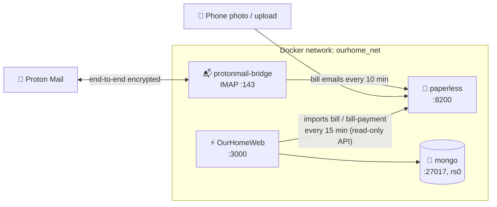

<div align="center">

# 🧩 OurHomeServices

**The supporting services for [OurHomeWeb](https://github.com/EOSOClub/OurHome),
each as its own Docker Compose stack with working defaults.**

[](./mongo)
[](./proton-bridge)
[](./paperless)
[](#quick-start)

[Services](#services) · [Quick start](#quick-start) · [How it fits together](#how-it-fits) · [🌐 OurHomeWeb](https://github.com/EOSOClub/OurHome) · [📱 OurHomeApp](https://github.com/EOSOClub/OurHomeApp)

</div>

---

OurHomeWeb's Docker deploy runs **only the web app**. The database and the
bill pipeline are separate stacks, so each can be updated, backed up or
swapped out on its own. This repo is those stacks.

<a id="services"></a>

## 📦 What's here

| Stack | What it is | Needed for |
| --- | --- | --- |
| [🍃 **mongo**](./mongo) | MongoDB 7, single-node replica set with auth | **Required.** OurHomeWeb's database |
| [📬 **proton-bridge**](./proton-bridge) | Headless Proton Mail Bridge (IMAP/SMTP inside Docker) | Bills by email, if your mail is Proton |
| [🧾 **paperless**](./paperless) | Paperless-ngx with OCR, plus Tika + Gotenberg for emails | Bills and receipts |

> [!NOTE]
> **Bills:** Paperless collects your bills, and OurHomeWeb imports the ones
> tagged `bill` / `bill-payment` onto its Bills page every 15 minutes. See
> [paperless → OurHomeWeb](./paperless/README.md#ourhomeweb).

<a id="how-it-fits"></a>

## 🗺️ How it fits together



Every stack joins one shared, pre-created Docker network, **`ourhome_net`**, so
containers reach each other by name (`mongo`, `protonmail-bridge`). It's the
same default OurHomeWeb uses (`DOCKER_NETWORK`). Nothing here is reachable from
outside the host unless you choose to publish it.

<a id="quick-start"></a>

## 🚀 Quick start

```bash
git clone https://github.com/EOSOClub/OurHomeServices.git
cd OurHomeServices
docker network create ourhome_net
```

Then bring the stacks up **in this order**. Each folder's README has the details.

| # | Stack | Commands |
| --- | --- | --- |
| 1 | **mongo** | `cp .env.example .env` · `openssl rand -base64 756 > keyfile` · `docker compose up -d` |
| 2 | **proton-bridge** *(optional)* | `docker compose build` · `docker compose run --rm protonmail-bridge init` · `docker compose up -d` |
| 3 | **paperless** *(optional)* | `cp .env.example .env` · `docker compose up -d` |
| 4 | **OurHomeWeb** | Set `SERVER_DATABASE_URL` (below), then [deploy it](https://github.com/EOSOClub/OurHome#-deploy-with-docker). |

Run each stack's commands from inside its folder (`cd mongo`, and so on).

**OurHomeWeb's `.env`** then points at this repo's Mongo:

```env
SERVER_DATABASE_URL=mongodb://household:<MONGO_APP_PASSWORD>@mongo:27017/household?replicaSet=rs0&authSource=admin
DOCKER_NETWORK=ourhome_net
```

## 🔌 Ports and addresses

| Service | Inside Docker | On the host (default) |
| --- | --- | --- |
| MongoDB | `mongo:27017` | `127.0.0.1:27018` |
| Proton Bridge | `protonmail-bridge:143` (IMAP), `:25` (SMTP) | not published |
| Paperless-ngx | `paperless:8000` | `127.0.0.1:8200` |
| OurHomeWeb | `ourhome_web:3000` | `127.0.0.1:3000` |

Everything binds to **localhost** by default. For outside access, use a reverse
proxy or tunnel (Cloudflare Tunnel, Caddy, nginx) rather than opening ports.

## 🔐 Secrets

Each stack keeps its secrets in its own gitignored files. Never commit them.

| File | Holds |
| --- | --- |
| `mongo/.env` | Root and app passwords |
| `mongo/keyfile` | Replica-set member key |
| `proton-bridge/state/` | Proton login, keychain |
| `paperless/.env` | Secret key, database password, admin login |

## 💾 Backups at a glance

| Stack | How |
| --- | --- |
| mongo | `mongodump` ([details](./mongo/README.md)) |
| proton-bridge | Nothing to back up. If `state/` is lost, log in again. |
| paperless | `document_exporter` ([details](./paperless/README.md)) |

## ❓ FAQ

<details>
<summary><b>Can I use MongoDB Atlas or an existing MongoDB instead?</b></summary>
<br>

Yes. Skip the `mongo` stack and point `SERVER_DATABASE_URL` at it. It must be a
**replica set**. Atlas always is; a self-run `mongod` needs `--replSet` and a
one-time `rs.initiate()`.

</details>

<details>
<summary><b>I don't use Proton Mail.</b></summary>
<br>

Skip `proton-bridge`. In Paperless, point the mail account at your provider's
IMAP server instead (Gmail, Fastmail and so on, usually with an app password).

</details>

<details>
<summary><b>Does OurHomeWeb send email through the Bridge?</b></summary>
<br>

Not by default. OurHomeWeb's email (password resets, reminders, bug reports)
uses any SMTP server via its `SERVER_SMTP_HOST` / `SMTP_*` settings, for example
Proton's own SMTP submission (`smtp.protonmail.ch:587` with an SMTP token).

</details>

---

<div align="center">
<sub>🧩 Part of the Our Home project · <a href="https://github.com/EOSOClub/OurHome">OurHomeWeb</a> · <a href="https://github.com/EOSOClub/OurHomeApp">OurHomeApp</a></sub>
</div>
